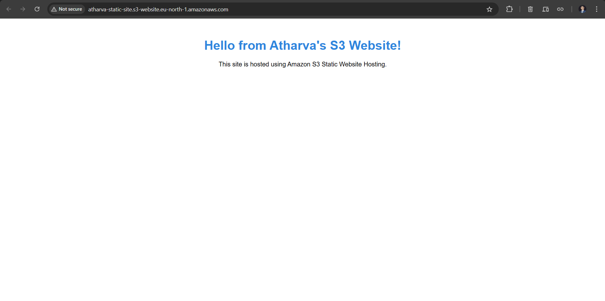

# Static Website Hosting on AWS S3

This project demonstrates how to host a static website using AWS S3.

## 🌐 Live Website
[Click here to view](http://atharva-static-site.s3-website.eu-north-1.amazonaws.com/)

## 📁 Technologies Used
- **AWS S3** for static website hosting
- **HTML** for webpage content

## ✅ Features
- Bucket creation and configuration
- Object upload with public access
- Static website hosting enabled
- Custom index page displayed

## 🖼️ Screenshots

### 🪣 1. Bucket Creation

### 📦 2. Object Upload

### 🔐 3. Permission and Policy

### 🌍 4. Hosted Website

## 📎 GitHub Repository
[https://github.com/AtharvaMSable/static-website-s3](https://github.com/AtharvaMSable/static-website-s3)
